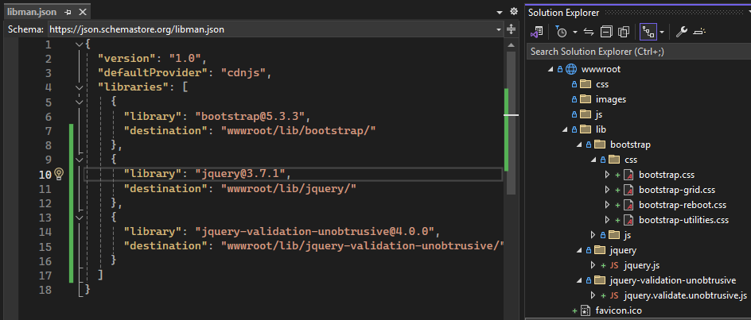

# EasyMed

## Introduction

## Frontend tools 

To manage frontend libraries in this project, we use [LibMan](https://learn.microsoft.com/en-us/aspnet/core/client-side/libman/?view=aspnetcore-8.0) (Library Manager). LibMan allows us to easily fetch and manage client-side libraries such as [Bootstrap](https://www.nuget.org/packages/bootstrap), [jQuery](https://www.nuget.org/packages/jQuery), and [jQuery Validation Unobtrusive](https://www.nuget.org/packages/microsoft.jquery.unobtrusive.validation/).

## ASP.NET-MVC-Core
## Introduction
Welcome to my ASP.NET Core MVC project! This application is built with modern web development practices and aims to provide a comprehensive demonstration of advanced features and best practices in creating scalable, secure, and user-friendly web applications. Below, you will find an overview of the key components and technologies utilized in this project:

### Key Features and Highlights
- Partial Views: Modularization of views to enhance reusability and maintainability.

- Ajax Integration: Enabling seamless asynchronous operations for an improved user experience.

- Image Uploads: Feature allowing users to upload and manage images efficiently.

- Data Annotation: Simplified data validation with built-in attributes.

- FluentValidation: Advanced and flexible validation rules for input handling.

- Authentication and Authorization (with Claims): Secure access control using modern claims-based mechanisms.

- ASP.NET Identity: Robust identity management and user authentication out of the box.

- Tag Helpers: Simplified and clean integration of server-side logic with HTML elements.

- Globalization: Supporting multiple languages and cultures for a global user base.

- Razor Syntax: Dynamic HTML rendering with clean and efficient Razor markup.

- JavaScript and jQuery Validator: Improving form validation and interactivity on the client side.

- Windows Modal/Dialog: Enhancing user interactions through dynamic modals.

- Three-Tier Architecture: Logical division into layers for data, business logic, and presentation, ensuring clean separation of responsibilities.

- Responsibility Division: Clear separation of concerns to improve maintainability and scalability.

## References
Dominando o ASP.NET MVC Core 2.x - [Eduardo Pires - Microsoft Regional Director](www.eduardopires.net.br)

## Roadmap:
Backend
ASP.NET Core MVC - For the Model-View-Controller architecture.

Razor (View Engine) - To dynamically generate HTML in views.

Entity Framework Core - For database access and data manipulation.

Authentication and Authorization with Claims - For access control.

REST APIs - To be integrated via Ajax calls.

Dependency Injection (DI) - To manage dependencies efficiently.

Frontend
Tailwind CSS (or Bootstrap) - For modern and responsive styling.

Ajax - For asynchronous communication with the backend.

Windows Modal/Dialog - To enhance user interaction and interfaces.

Testing and Quality Assurance
xUnit or NUnit - For unit testing.

Mocking (with Moq) - To simulate dependencies and facilitate testing.

DevOps and Monitoring Tools
Docker - For containerization and deployment in isolated environments.

GitHub Actions or Azure DevOps - For continuous integration and deployment (CI/CD).

Serilog - For structured logging and monitoring.

Additional Features
Internationalization (Localization) - To support multiple languages.

DDD-Oriented Design - For a robust domain-driven architecture.

Security Best Practices - Such as CSRF, XSS protection, and server-side input validation.

AI implementatio to text improvement 

Globalization with regex files
